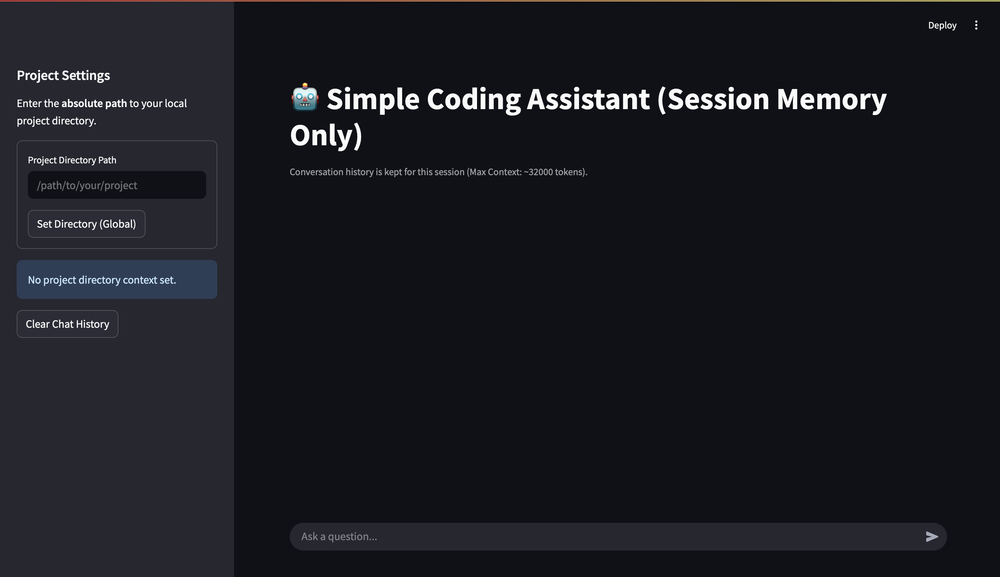

# Coding Assistant

Your Local AI Pair Programmer: Point this AI assistant to your project folder and start asking questions!

It reads your code locally to provide truly context-aware help, explanations, and suggestions directly related to your files. Code smarter, locally.



## Prerequisites 📝

- **Python:** Version 3.11 or higher recommended.
- **`tree` command:** The `get_tree_folders` tool relies on this.
  - **Linux (Debian/Ubuntu):** `sudo apt update && sudo apt install tree`
  - **macOS (using Homebrew):** `brew install tree`

## Installation ⚙️

1. **Clone the repository:**

   ```bash
   git clone https://github.com/Bessouat40/coding-assistant
   cd coding-assistant
   ```

2. **Install Python dependencies:**

   ```bash
   pip install -r requirements.txt
   ```

## Configuration 🔑

1. **API Keys & Settings:** Sensitive information like LLM API keys should be stored in a `.env` file in the project's root directory. - Copy the example file or create a new file named `.env`:

   ```bash
   cp .env.example .env
   ```

- Edit the `.env` file and add your keys:

  ```dotenv
  # .env
  MISTRAL_API_KEY=your_mistral_api_key_here
  # GOOGLE_API_KEY=your_google_api_key_here
  # Add other variables if needed, e.g., MAX_CONTEXT_TOKENS=7000
  ```

2. **LLM Provider:** Change LLM provider if you want :

- Go to `api/utils.py` and modify `loadl_llm` function. Uncomment the line with the provider you need.
  By default, it's set to `Google` :

```python
def load_llm(logger):
    try:
        model = ChatOllama(model="llama3.1:8b")
        # model = ChatMistralAI(model="codestral-latest")
        # model = ChatGoogleGenerativeAI(model="gemini-2.0-flash-001")
        logger.info(f"ChatGoogleGenerativeAI model '{model.model}' initialized successfully.")
        return model
    except Exception as e:
        logger.error(f"Failed to initialize the LLM model: {e}")
        raise RuntimeError(f"Could not initialize LLM: {e}") from e
```

## Running the Application ▶️

A convenience script `launch_assistant.sh` is provided to start all components.

1. **Make the script executable:**

   ```bash
   chmod +x launch_assistant.sh
   ```

2. **Run the script:**

   ```bash
   ./launch_assistant.sh
   ```

This script will:

- Load environment variables from `.env`.
- Start the MCP Tool Server (`agent_tools.py`) in the background (logs to `mcp_server.log`).
- Start the FastAPI Backend (`api.py`) in the background (logs to `fastapi_api.log`).
- Start the Streamlit UI (`streamlit_app.py`) in the background (logs to `streamlit_ui.log`).
- Print the URLs and PIDs for each component.

You can view logs in the specified `.log` files for debugging. Press `Ctrl+C` in the terminal where you ran the script to stop all components gracefully.

## Usage 🧑‍💻

1. **Access the UI:** Open your web browser and navigate to the Streamlit URL (usually `http://localhost:8501`).
2. **Set Project Directory:** In the sidebar, enter the **absolute path** to the local project directory you want the assistant to work with. Click "Set Directory".
3. **Chat:** Use the chat input at the bottom to ask questions about the code in the specified directory. Examples:
   - "Explain the purpose of the `run_agent` function in `api.py`."
   - "Show me the file structure of this project." (Uses `tree`)
   - "What arguments does the `generate_response_api` function take?"
   - "Read the contents of `prompt.py`." (Uses `cat`)
   - "Can you suggest improvements to the error handling in `streamlit_app.py`?"
4. **Follow-up:** The assistant remembers the context of your current chat session. Ask follow-up questions naturally.
5. **Clear History:** Use the "Clear Chat History" button in the sidebar to start a fresh conversation.
